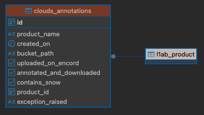

# Annotation db

- [Why do I need a table to manage my annotations?](#why-do-i-need-a-table-to-manage-my-annotations)
- [Cloud annotations table](#cloud-annotations-table)
  - [Columns](#columns)
  - [Migrations](#migrations)
- [TODO/WIP](#todowip)

The annotation schema can be found under the production database. For this reason all the previous migrations were declared under the [`spacelab-pipeline` repo](https://github.com/traktorspace/spacelab-pipeline), which currently handles it.\
If you want to read more information about the database please have a look at its dedicated [README](https://github.com/traktorspace/spacelab-pipeline/blob/develop/packages/hyperfield-db/README.md).\

For the annotation pipeline, a dedicated schema has been created: the `annotations` schema. Please create a dedicated table under that schema for your annotation project.

## Why do I need a table to manage my annotations?

Handling pruducts and their annotation status can become difficult when the uploading/downloading is not performed on the entire archive and instead it's only done on a subset of the available data. For this reason relying on a db that can store these information can save lot of time.\
By living in the same db as the production, it's possible to link the annotations to the original products and therefore always fetch the latest version.

## Cloud annotations table

### Columns

  
  
<em>The cloud_annotation table schema</em>

| #   | Column                 | Data type   | Not null | Default            | Comment                                                                                    |
| --- | ---------------------- | ----------- | -------- | ------------------ | ------------------------------------------------------------------------------------------ |
| 1   | id                     | uuid        | Yes      | uuid_generate_v4() | Unique identifier                                                                          |
| 2   | product_name           | varchar     | Yes      |                    | eg: `hyperfield1a_L1B_20250607T190038`                                                     |
| 3   | created_on             | timestamptz | Yes      |                    | Row insertion timestamp                                                                    |
| 4   | bucket_path            | varchar     | Yes      |                    | Path to remote Google cloud bucket                                                         |
| 5   | uploaded_on_encord     | bool        | Yes      | false              | If the data has been uploaded on Encord                                                    |
| 6   | annotated_and_download | bool        | Yes      | false              | If the data is part of the dataset (has been annotated and downloaded to disk)             |
| 7   | contains_snow          | bool        | No       |                    | If the image is over snow                                                                  |
| 8   | product_id             | uuid        | Yes      |                    | Foreign key that points to `l1ab_product` table row of the product that has been annotated |
| 9   | exception_raised       | varchar     | No       |                    | Python traceback dump if error occured                                                     |

### Migrations
Here are reported the migrations declared for the `cloud_annotations` table.\
All the migrations are handled with [`dbmate`](https://github.com/amacneil/dbmate)

1. [20250702130635_add-annotations-schema.sql](https://github.com/traktorspace/spacelab-pipeline/blob/a7d7a5474b5775a4e7135918014d2fc848927128/packages/hyperfield-db/db/migrations/20250702130635_add-annotations-schema.sql)
2. [20250703080156_create-cloud-annotations-table.sql](https://github.com/traktorspace/spacelab-pipeline/blob/a7d7a5474b5775a4e7135918014d2fc848927128/packages/hyperfield-db/db/migrations/20250703080156_create-cloud-annotations-table.sql)
3. [20250708072948_alter-cloud-annotation-table-add-fk2product.sql](https://github.com/traktorspace/spacelab-pipeline/blob/a7d7a5474b5775a4e7135918014d2fc848927128/packages/hyperfield-db/db/migrations/20250708072948_alter-cloud-annotation-table-add-fk2product.sql)
4. [20250718110602_add-exception-column-to-cloudannotations.sql](https://github.com/traktorspace/spacelab-pipeline/blob/a7d7a5474b5775a4e7135918014d2fc848927128/packages/hyperfield-db/db/migrations/20250718110602_add-exception-column-to-cloudannotations.sql)
5. [20250911130350_cloud_annotations_alter_exception_raised_column_type.sql](https://github.com/traktorspace/spacelab-pipeline/blob/develop/packages/hyperfield-db/db/migrations/20250911130350_cloud_annotations_alter_exception_raised_column_type.sql)

## TODO/WIP
- [ ] Create a script to refresh foreign key in db so that annotations always points to latest file 
  - [ ]   Currently this is done by sql query at runtime that takes most recent product